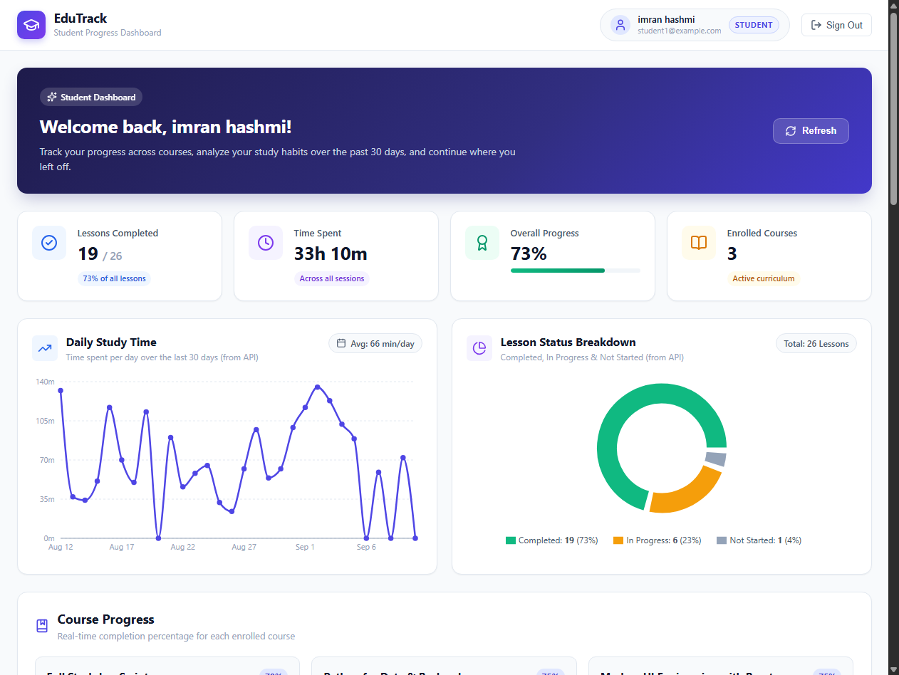
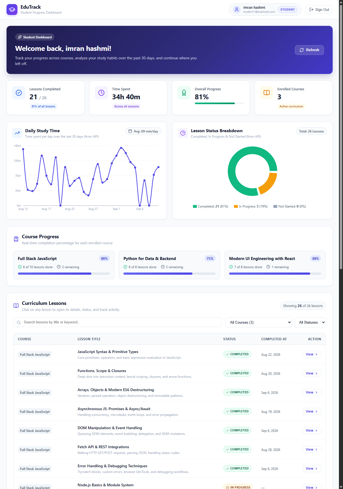
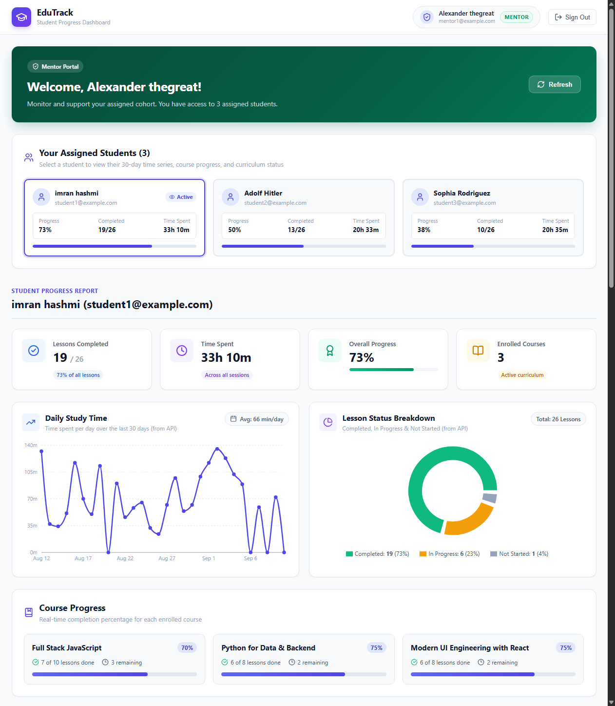
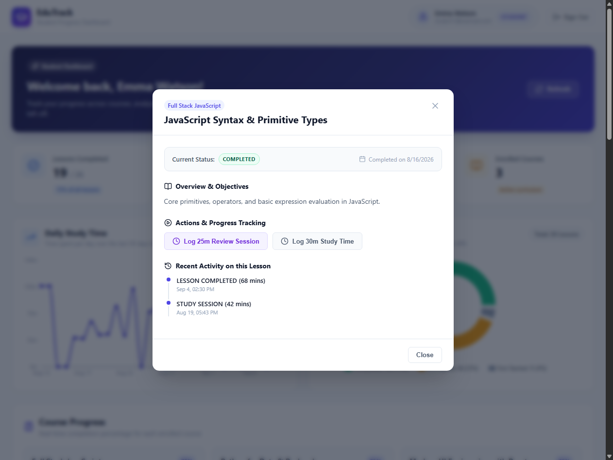
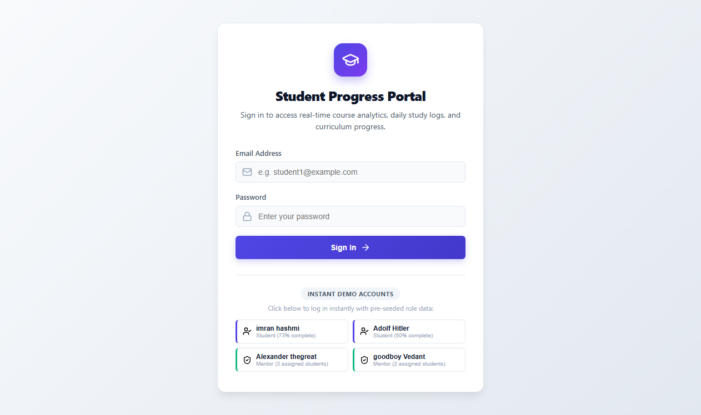

# Student Progress Dashboard (EduTrack)

[](https://github.com/VedantKhalshinge)
[](https://github.com/VedantKhalshinge/Student-Progress-Dashboard)
[](LICENSE)

A full-stack student learning analytics and progress tracking web application engineered and designed by **[Vedant Khalshinge](https://github.com/VedantKhalshinge)** using **React 19**, **Recharts**, **Express.js**, and **Prisma ORM (SQLite)**.

EduTrack provides role-based learning portals with strict security isolation:
- **Students** view only their own progress, interactive 30-day study charts, course completion percentages, and interactive curriculum lessons with activity tracking.
- **Mentors** view only their assigned student cohorts and can drill down into any student's complete analytics dashboard.

---

## 👤 Author & Ownership Notice

> [!IMPORTANT]
> **Original Project Author**: [Vedant Khalshinge](https://github.com/VedantKhalshinge)  
> **Source Repository**: [https://github.com/VedantKhalshinge/Student-Progress-Dashboard](https://github.com/VedantKhalshinge/Student-Progress-Dashboard)  
> All architecture, database design, API implementations, UI components, visualizations, and documentation in this repository are the original work of Vedant Khalshinge.
> 
> **Anti-Plagiarism & Attribution Policy**:
> Any academic, portfolio, or commercial reuse of this codebase requires explicit credit and attribution to the author. Re-uploading or claiming this codebase as your own without direct attribution is strictly prohibited.

---

## Dashboard Preview

### Student Dashboard & Interactive Visualizations


### Full Student Dashboard with Course Progress & Lessons Table


### Mentor Cohort Portal & Student Drilldown


### Lesson Details Modal with Activity Logging


### Role-Based Login Screen with Instant Demo Logins


---

## Features

- **Role-Based Authentication & Isolation**:
  - Secure JWT authentication.
  - Students can only access their own profile and study analytics.
  - Mentors can only access data for students assigned to them.
- **Student Dashboard Metrics**:
  - Total lessons completed out of enrolled curriculum (e.g. `19 / 26`).
  - Total study time formatted in hours and minutes (e.g. `28h 15m`).
  - Overall curriculum completion percentage with visual progress ring/bar.
  - Enrolled courses count.
- **Interactive Recharts Visualizations**:
  - **Line Chart**: Daily study time (minutes) over the past 30 days rendered directly from backend API time-series data.
  - **Donut Chart**: Status breakdown showing distribution of Completed, In Progress, and Not Started lessons with legend percentages.
- **Course Progress**:
  - Course cards showing real-time completion percentage, completed/total lesson counts, and animated progress bars for each enrolled course.
- **Curriculum Lesson List & Modal Details**:
  - Search lessons by keyword and filter by Course or Completion Status.
  - Click any lesson to view full description, completion timestamp, and historical activity timeline.
  - Interactive student actions: **Open Lesson** (transitions to `IN_PROGRESS`), **Mark as Completed** (transitions to `COMPLETED`), and **Log Study Session** (records duration in minutes).
  - Metrics and charts update in real time upon recording activity.
- **One-Command Database Seeding**:
  - Automatically seeds 2 mentors, 5 students, 3 complete courses, and 30 days of realistic study activity.

---

## Getting Started

### Prerequisites
- Node.js (v18+)
- npm (v9+)

### Installation

Clone or open the project folder:
```bash
git clone https://github.com/VedantKhalshinge/Student-Progress-Dashboard.git
cd Student-Progress-Dashboard
```

Install backend and frontend dependencies:
```bash
# Install server dependencies
cd server && npm install

# Install client dependencies
cd ../client && npm install
```

### Database Setup & Seeding (One Command)

From the project root:
```bash
npm run seed
```
*(Or from the server directory: `npm run db:seed`)*

This runs Prisma migrations and executes `prisma/seed.js` to populate mentors, students, courses, lessons, and 30 days of activity logs.

### Running the Application

In two separate terminal windows (or using background processes):

**Terminal 1 (Backend API - Port 5000):**
```bash
cd server
npm run dev
```

**Terminal 2 (Frontend Client - Port 3000):**
```bash
cd client
npm run dev
```

Open [http://localhost:3000](http://localhost:3000) in your web browser.

---

## Demo Credentials

All test accounts use the password: `password123`

| Role | Name | Email | Password | Assigned Students / Notes |
| :--- | :--- | :--- | :--- | :--- |
| **Student** | imran hashmi | `student1@example.com` | `password123` | High-achiever cohort (73% complete) |
| **Student** | Adolf Hitler | `student2@example.com` | `password123` | Steady learner (50% complete) |
| **Student** | Sophia Rodriguez | `student3@example.com` | `password123` | Developing learner (38% complete) |
| **Student** | Noah Patel | `student4@example.com` | `password123` | Assigned to Mentor 2 (60% complete) |
| **Student** | Olivia Kim | `student5@example.com` | `password123` | Assigned to Mentor 2 (25% complete) |
| **Mentor** | Alexander thegreat | `mentor1@example.com` | `password123` | Senior Mentor (Manages imran, Adolf, Sophia) |
| **Mentor** | goodboy Vedant | `mentor2@example.com` | `password123` | Lead Instructor (Manages Noah, Olivia) |

*(Quick demo login buttons are also available directly on the login screen for 1-click evaluation).*

---

## API Endpoints Specification

All endpoints under `/api/dashboard`, `/api/lessons`, `/api/activity`, and `/api/mentor` require an `Authorization: Bearer <token>` header obtained from `/api/auth/login`.

### Authentication Endpoints

| Method | Endpoint | Access | Description | Request Body | Response |
| :--- | :--- | :--- | :--- | :--- | :--- |
| `POST` | `/api/auth/login` | Public | Authenticates student or mentor with email & password | `{ "email": "...", "password": "..." }` | `{ "token": "...", "user": { "id": 1, "name": "...", "email": "...", "role": "STUDENT" } }` |

---

### Student Dashboard Endpoints (Role: STUDENT)

| Method | Endpoint | Access | Description | Request / Params | Response Fields |
| :--- | :--- | :--- | :--- | :--- | :--- |
| `GET` | `/api/dashboard/summary` | Student | Retrieves aggregated dashboard metrics for authenticated student | None | `lessonsCompleted`, `totalLessons`, `totalTimeFormatted`, `totalTimeMinutes`, `overallProgress`, `coursesEnrolled`, `coursesProgress` |
| `GET` | `/api/dashboard/time-series` | Student | Daily study minutes for the last 30 days (for line chart) | None | Array of `{ "date": "YYYY-MM-DD", "minutes": 45 }` |
| `GET` | `/api/dashboard/lesson-status` | Student | Breakdown of lessons by status (for donut chart) | None | `{ "completed": 19, "inProgress": 6, "notStarted": 1 }` |
| `GET` | `/api/lessons` | Student | List of all enrolled lessons with completion status | None | Array of `{ "id": 1, "title": "...", "courseName": "...", "status": "COMPLETED", "completedAt": "..." }` |
| `GET` | `/api/lessons/:id` | Student | Detailed lesson information and recent activity history | `id` (lesson ID) | `{ "id": 1, "title": "...", "description": "...", "courseName": "...", "status": "...", "recentActivities": [...] }` |
| `POST` | `/api/activity` | Student | Records an activity event (lesson opened, completed, study time) | `{ "lessonId": 1, "type": "LESSON_COMPLETED", "durationMinutes": 30 }` | `{ "id": 42, "studentId": 1, "lessonId": 1, "type": "...", "durationMinutes": 30, "createdAt": "..." }` |

---

### Mentor Cohort Endpoints (Role: MENTOR)

| Method | Endpoint | Access | Description | Request / Params | Response Fields |
| :--- | :--- | :--- | :--- | :--- | :--- |
| `GET` | `/api/mentor/students` | Mentor | Lists only the students assigned to the authenticated mentor | None | Array of `{ "id": 1, "name": "...", "email": "...", "overallProgress": 73, "lessonsCompleted": 19, "totalLessons": 26, "totalTimeFormatted": "28h 15m" }` |
| `GET` | `/api/mentor/students/:id/summary` | Mentor | Retrieves full dashboard metrics for an assigned student *(returns 403 if not assigned to mentor)* | `id` (student ID) | `studentId`, `studentName`, `lessonsCompleted`, `totalLessons`, `overallProgress`, `coursesProgress`, etc. |
| `GET` | `/api/mentor/students/:id/time-series` | Mentor | 30-day study minutes time-series for an assigned student | `id` (student ID) | Array of `{ "date": "YYYY-MM-DD", "minutes": ... }` |
| `GET` | `/api/mentor/students/:id/lesson-status` | Mentor | Lesson status breakdown (completed/in progress/not started) for assigned student | `id` (student ID) | `{ "completed": ..., "inProgress": ..., "notStarted": ... }` |
| `GET` | `/api/mentor/students/:id/lessons` | Mentor | Lesson curriculum and completion statuses for assigned student | `id` (student ID) | Array of student's lessons |

---

## Security & Role Isolation Verification

1. **Student Isolation**:
   - The student endpoints (`/api/dashboard/summary`, `/api/dashboard/time-series`, `/api/dashboard/lesson-status`, `/api/lessons`) extract the user ID strictly from the verified JWT (`req.user.id`). A student cannot supply another student's ID or view another student's data.
   - Any attempt by a student to call mentor endpoints returns `403 Forbidden`.
2. **Mentor Cohort Isolation**:
   - The mentor route `/api/mentor/students` only queries students whose `mentorId` matches the authenticated mentor's ID.
   - For individual student queries (`/api/mentor/students/:id/...`), the server verifies that `student.mentorId === req.user.id`. If a mentor attempts to access a student assigned to another mentor, the API responds with `403 Forbidden: Student not assigned to you`.

---

## 📜 License & Intellectual Property

This project is licensed under the **MIT License** with attribution requirements:
- Copyright (c) 2026 **Vedant Khalshinge** ([https://github.com/VedantKhalshinge](https://github.com/VedantKhalshinge)).
- You are free to inspect, review, and fork this project for evaluation purposes.
- Any distribution, modification, or inclusion in portfolios or submissions must retain the original copyright and author notice.